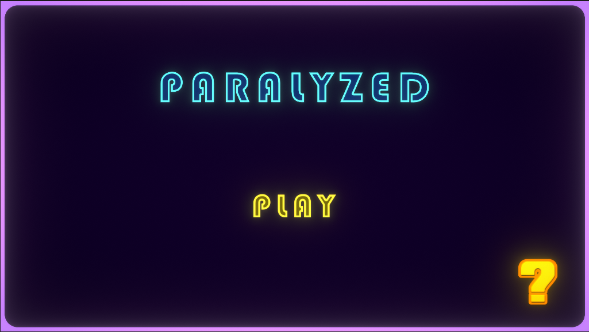
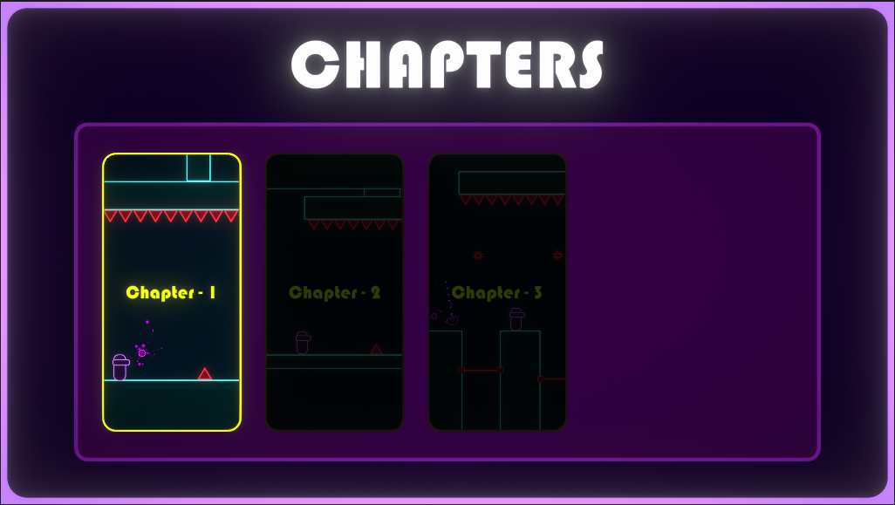
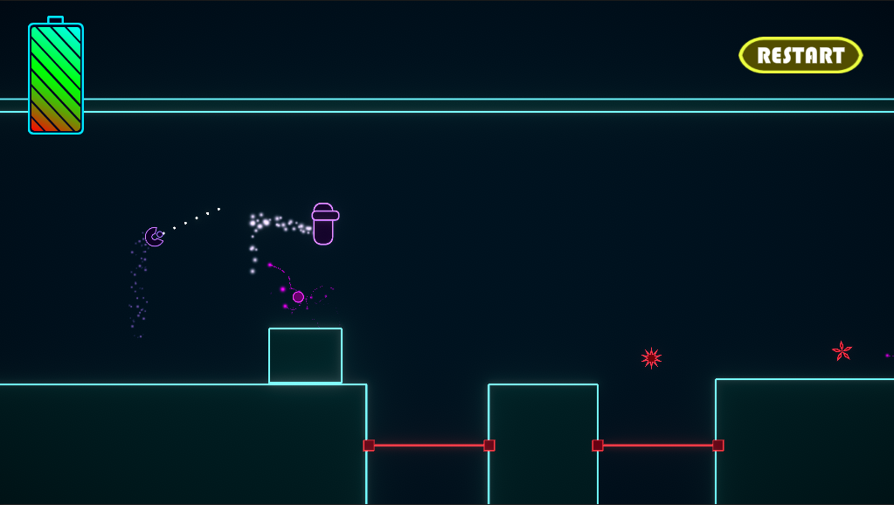
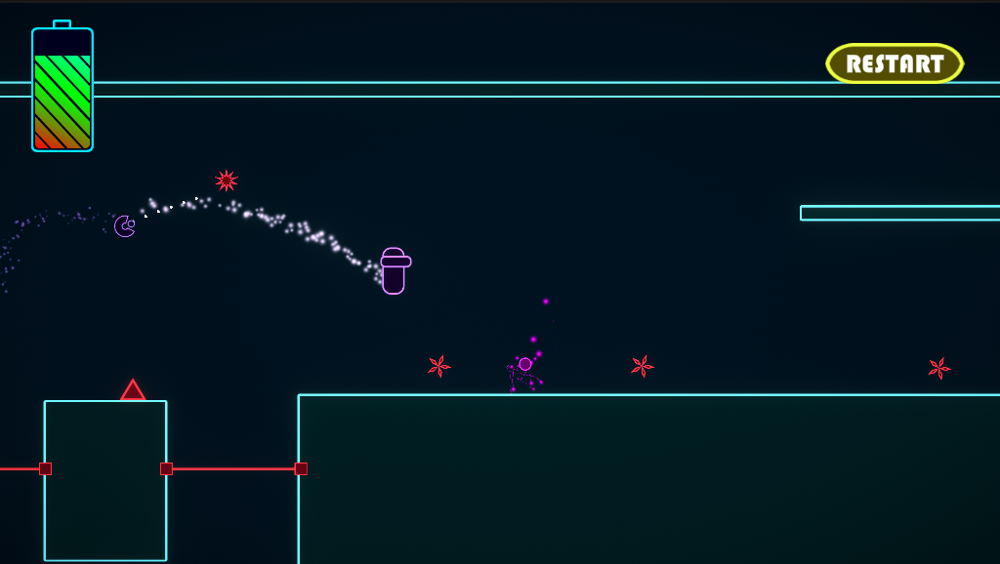
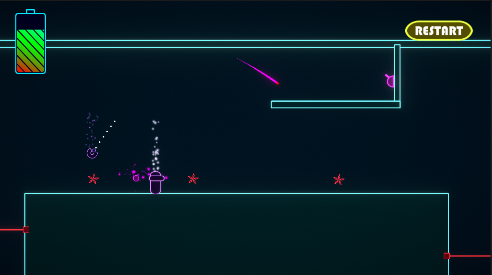
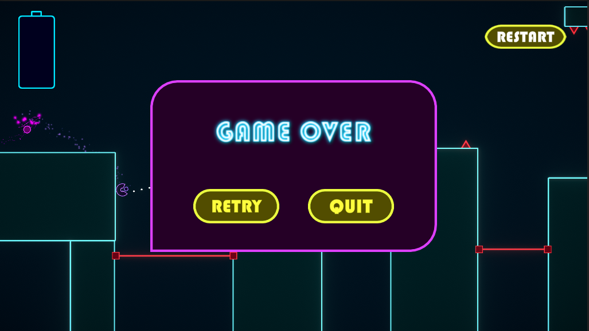

# Brackey-s-Game-Jam-2022.2
This is the repo for Brackey's game jam 2022.2.
 Avoid the obstacles. Launch yourself to freedom. Don't worry, The spirits will guide you.

# Team members
- Gowrav - https://github.com/ambrollins
- Aditya - https://github.com/mastermind79832
- Manjunath MP - https://github.com/mppavan05
- Amit - https://github.com/Amit8844

# Controls
- Left mouse Button to shoot
- Right mouse button to Boost up

# How To Play
You have to shoot at youself to move.  And aim at the right angle to get the currect launch.

# Project Link
- https://xclad.itch.io/paralyzed

# ScreenShots

